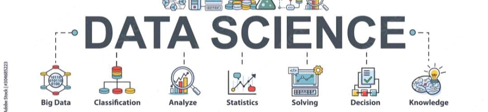

 
<h1 align="center">Hi 👋, I'm Abhishek Kumar</h1>
<h1 align="center">Top Data Science Voice at Linkedln</h1>
<h3 align="center">A Passionate Data Science, Data Analytics, Enthusiast from India</h3>

 

  

  

- 🔭 I’m currently working on **Generative AI**

- 🌱 I’m currently learning **Machine Learning, Deep Learning, NPL, Computer vision **

- 👨‍💻 All of my projects are available at [https://github.com/abhishekkumar62000/](https://github.com/abhishekkumar62000/)

- 💬 Ask me about **Data Science, Data analytics, Machine Learning, Deep Learning, Data visualization:- Power BI, Tableau,Python, SQL, Statistics**

- 📫 How to reach me **abhiydv23096@gmail.com**

<h3 align="left">Connect with me:</h3>

<h3 align="left">Languages and Tools:</h3>

            

&nbsp;

