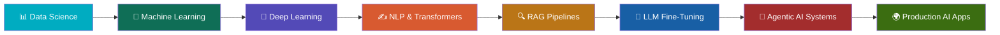

<div align="center">

<!-- ANIMATED HEADER -->


<!-- TYPING SVG -->
<a href="https://git.io/typing-svg">
  
</a>

<!-- Typing Animation -->
<a href="https://git.io/typing-svg">
  
</a>

<br/>

<br/><br/>

<!-- BADGES ROW -->
<a href="https://www.linkedin.com/in/abhishek-kumar-807853375">
  
</a>
<a href="https://abhi-yadav.vercel.app/">
  
</a>
<a href="mailto:abhiydv23096@gmail.com">
  
</a>
<a href="https://github.com/sponsors/abhishekkumar62000">
  
</a>

<br/>


</div>

---

<!-- SNAKE ANIMATION -->
<div align="center">
  <picture>
    <source media="(prefers-color-scheme: dark)" srcset="https://raw.githubusercontent.com/platane/snk/output/github-contribution-grid-snake-dark.svg" />
    <source media="(prefers-color-scheme: light)" srcset="https://raw.githubusercontent.com/platane/snk/output/github-contribution-grid-snake.svg" />
    
  </picture>
</div>

---

## 🧬 The Code Behind the Person


```python
#!/usr/bin/env python3
# -*- coding: utf-8 -*-

class AbhishekYadav:
    """
    AI Engineer | Data Scientist | LLM Builder
    Bihar, India 🇮🇳  →  Changing the AI World 🌍
    """

    def __init__(self):
        self.name         = "Abhishek Yadav"
        self.title        = "Aspiring AI / LLM Engineer"
        self.linkedin     = "🔥 Top Data Science Voice"
        self.location     = "Bihar, India 🇮🇳"
        self.portfolio    = "https://abhi-yadav.vercel.app/"
        self.email        = "abhiydv23096@gmail.com"
        self.open_to      = ["Freelance", "Collaborations", "Research"]
        self.superpower   = "Turning raw data → AI-powered decisions 💡"

    def current_focus(self):
        return {
            "building"  : ["RAG Pipelines", "LLM Fine-Tuning Apps"],
            "learning"  : ["Advanced NLP", "Computer Vision", "MLOps"],
            "exploring" : ["Agentic AI", "LangGraph", "Multimodal LLMs"],
        }

    def tech_philosophy(self):
        return (
            "Every dataset has a hidden story. "
            "With curiosity + cutting-edge tools, "
            "I uncover it. 🔍"
        )

    def fun_facts(self):
        return [
            "☕ Powered by chai and Python",
            "📊 Obsessed with clean visualizations",
            "🧠 Thinks in tensors, speaks in insights",
            "🌙 Best code written after midnight",
        ]

if __name__ == "__main__":
    me = AbhishekYadav()
    print(me.tech_philosophy())
```

<br clear="right"/>

---

## 🚀 About Me — Full Story

<table>
<tr>
<td width="60%">

### Who Am I?

I am **Abhishek Yadav** — an Aspiring **AI/LLM Engineer** and passionate **Data Scientist** from Bihar, India 🇮🇳, recognized as a **Top Data Science Voice** on LinkedIn.

My mission is to transform complex, raw datasets into **AI-powered, actionable solutions** that drive real-world impact. I specialize in:

- 🤖 **Generative AI** — Building LLM-powered apps from scratch
- 🔍 **RAG Pipelines** — Retrieval-Augmented Generation for smart AI
- 🧠 **LLM Fine-Tuning** — Domain-specific model adaptation
- 📊 **Data Science** — End-to-end ML pipelines and analytics
- 👁️ **Computer Vision** — YOLO & OpenCV powered vision systems
- 🌐 **Full-Stack AI Apps** — Flask, FastAPI + LangChain deployments

### My Core Belief
> *"I believe every dataset has a hidden story waiting to be uncovered. With curiosity, technical expertise, and cutting-edge tools, I am on a mission to solve real-world challenges through data and AI."*

</td>
<td width="40%" align="center">

### 🌟 Quick Facts

| | |
|---|---|
| 🎓 | Self-taught AI Engineer |
| 📍 | Bihar, India 🇮🇳 |
| 🔭 | Building Gen AI & LLM Apps |
| 🌱 | Learning RAG & Fine-Tuning |
| 💬 | Ask me about Data Science |
| 💡 | 15,264+ GitHub Contributions |
| 🏆 | LinkedIn Top Data Science Voice |
| 📧 | abhiydv23096@gmail.com |
| 🌐 | [Portfolio](https://abhi-yadav.vercel.app/) |

</td>
</tr>
</table>

---

## 🛠️ Complete Tech Arsenal

### 👨‍💻 Programming Languages


### 📊 Data Science & Machine Learning


### 🤖 AI, Deep Learning & Generative AI


### 📈 Data Visualization & BI


### 🗄️ Databases


### 🌐 Web Frameworks & Deployment


### 🔧 Tools & DevOps


---

## 🧠 AI / ML Expertise Map

```
╔══════════════════════════════════════════════════════════════════╗
║              🤖 SKILL PROFICIENCY RADAR                         ║
╠═══════════════════════════╦══════════════════════════════════════╣
║  Skill                    ║  Level                   Score      ║
╠═══════════════════════════╬══════════════════════════════════════╣
║  Machine Learning         ║  ████████████████████  Expert  95% ║
║  Data Analysis & EDA      ║  ████████████████████  Expert  95% ║
║  Deep Learning            ║  ██████████████████░░  Adv.    90% ║
║  NLP & Text Mining        ║  ██████████████████░░  Adv.    88% ║
║  Data Visualization       ║  ███████████████████░  Expert  92% ║
║  Generative AI / LLMs     ║  █████████████████░░░  Adv.    85% ║
║  RAG Pipelines            ║  ████████████████░░░░  Int+    80% ║
║  LLM Fine-Tuning          ║  ███████████████░░░░░  Int+    75% ║
║  Computer Vision          ║  ██████████████░░░░░░  Int.    70% ║
║  SQL & Databases          ║  ████████████████████  Expert  93% ║
║  Power BI / Tableau       ║  ████████████████████  Expert  90% ║
║  Flask / FastAPI          ║  ███████████████░░░░░  Int+    75% ║
║  Prompt Engineering       ║  █████████████████░░░  Adv.    85% ║
╚═══════════════════════════╩══════════════════════════════════════╝
```

---

## 🔥 Active Projects & Status

<div align="center">

```
┌──────────────────────────────────────────────────────────────────┐
│                  🚀 ACTIVE PROJECTS — 2025                       │
├────────────┬─────────────────────────────────────────────────────┤
│  🔴 LIVE   │  RAG-Powered Document Q&A (LangChain + FAISS)       │
│  🟡 WIP    │  LLM Fine-Tuned Customer Support Chatbot            │
│  🟡 WIP    │  AI Medical Report Analyzer (BERT + Transformers)   │
│  🟢 DONE   │  Malicious URL Detector (Deep Learning)             │
│  🟢 DONE   │  100-Days Machine Learning Challenge ✅             │
│  🔵 NEXT   │  Multimodal AI App (Vision + Language Model)        │
│  🔵 NEXT   │  Agentic AI Workflow with LangGraph                 │
│  🟣 IDEAS  │  AI-Powered Resume Screener (GenAI)                 │
│  🟣 IDEAS  │  Recommender System with Hybrid Filtering           │
└────────────┴─────────────────────────────────────────────────────┘
```

</div>

---

## 🗺️ My AI / ML Roadmap 2025


```mermaid
graph LR
    A[📊 Data Science] --> B[🤖 Machine Learning]
    B --> C[🧠 Deep Learning]
    C --> D[✍️ NLP & Transformers]
    D --> E[🔍 RAG Pipelines]
    E --> F[🎯 LLM Fine-Tuning]
    F --> G[🚀 Agentic AI Systems]
    G --> H[🌍 Production AI Apps]

    style A fill:#00ACC1,color:#fff
    style B fill:#0F6E56,color:#fff
    style C fill:#534AB7,color:#fff
    style D fill:#D85A30,color:#fff
    style E fill:#BA7517,color:#fff
    style F fill:#185FA5,color:#fff
    style G fill:#A32D2D,color:#fff
    style H fill:#3B6D11,color:#fff
```

---

## 📊 GitHub Analytics Dashboard

<div align="center">


<br/>


</div>

---

## 🏆 GitHub Trophies

<div align="center">


</div>

---

## 📈 Contribution Activity Graph

<div align="center">


</div>

---

## 🌟 Featured Projects

> 🔗 Explore all 100+ projects at **[github.com/abhishekkumar62000](https://github.com/abhishekkumar62000)**

<div align="center">

[](https://github.com/abhishekkumar62000/Malicious-URL-Detection-Deep-Learning-Project)
[](https://github.com/abhishekkumar62000/100-Days-Machine-Learning-Project)

</div>

### 🗂️ Project Categories

| Category | Description | Tech Stack |
|:---|:---|:---|
| 🤖 **Generative AI** | LLM-powered apps, chatbots, RAG systems | LangChain, OpenAI, HuggingFace |
| 📊 **Data Science** | EDA, statistical analysis, dashboards | Pandas, Seaborn, Power BI |
| 🧠 **Deep Learning** | CNNs, RNNs, Transformers | TensorFlow, PyTorch, Keras |
| 👁️ **Computer Vision** | Object detection, image classification | YOLO, OpenCV, PIL |
| 📝 **NLP** | Sentiment analysis, text classification | BERT, T5, SpaCy |
| 🔍 **RAG & LLMs** | Document QA, vector search | FAISS, ChromaDB, LangChain |
| 🌐 **Web AI Apps** | AI-powered web deployments | Flask, FastAPI, Streamlit |
| 📈 **ML Models** | Classification, regression, clustering | Scikit-learn, XGBoost |
| 📊 **BI Dashboards** | Business intelligence & storytelling | Power BI, Tableau, Plotly |
| 🤝 **Recommender Systems** | Collaborative & content-based | Hybrid Models, Matrix Factorization |

---

## 🤝 Services & What I'm Looking For

<div align="center">

| 💼 What I Offer | 🎯 Looking For |
|:---|:---|
| 🔧 Custom ML/AI model development | 🤝 Open-source collaborations |
| 📊 Data analytics & BI dashboards | 💼 Freelance AI/ML projects |
| 🤖 LLM fine-tuning & RAG pipelines | 🏢 Full-time AI Engineer roles |
| 🎨 Data visualization & storytelling | 🔬 Research partnerships |
| 👨‍🏫 Data Science mentorship | 📢 Speaking & workshop opportunities |
| 🌐 AI web app development (Flask/FastAPI) | 🚀 AI startup consulting |

</div>

---

## 📚 My Learning Journey Timeline

```
2022  ──►  Foundation: Python, SQL, Statistics, Excel, Data Cleaning
           └── First ML models: Linear Regression, Decision Trees

2023  ──►  Core ML: Scikit-learn, Pandas, Matplotlib, Seaborn
           └── BI Tools: Power BI, Tableau | 50+ Projects on GitHub

2024  ──►  Deep Learning: TensorFlow, Keras, PyTorch
           └── NLP & Computer Vision: BERT, YOLO, OpenCV, T5
           └── Databases: MySQL, SQLite, MS SQL Server

2025  ──►  Generative AI: HuggingFace, OpenAI API, LangChain
           └── RAG Pipelines, LLM Fine-Tuning, Prompt Engineering
           └── Web Deployment: Flask, FastAPI, Streamlit

2025+ ──►  Agentic AI: LangGraph, Multi-Agent Systems, MLOps
           └── Multimodal LLMs, Vector DBs (FAISS, ChromaDB)
```

---

## 💡 AI Domains I Work In

<div align="center">

```
┌─────────────────────────────────────────────────────────┐
│  🌐 DOMAINS OF EXPERTISE                                │
├─────────────────────────────────────────────────────────┤
│  🏥 Healthcare AI     │  Medical report analysis, NLP   │
│  🛡️ Cybersecurity AI  │  Malicious URL/threat detection  │
│  📈 Finance AI        │  Predictive analytics, forecasts │
│  🛒 Retail/E-comm     │  Recommender systems, churn pred │
│  📰 NLP/Text AI       │  Summarization, classification   │
│  👁️ Vision AI         │  Object detection, image class.  │
│  💬 Conversational AI │  Chatbots, QA systems, RAG       │
└─────────────────────────────────────────────────────────┘
```

</div>

---

<!-- ============================================================ -->
<!--          🏆 ACHIEVEMENTS & VENTURES SECTION                  -->
<!-- ============================================================ -->

<div align="center">


<br/>


</div>

---

## 🏆 Achievements & What I'm Building

> 🌟 *Beyond code and data — I build products, platforms, and movements that create real-world impact.*

---

### 🚀 Ventures I've Founded & Built

<div align="center">

```
╔══════════════════════════════════════════════════════════════════╗
║           👨‍💼 ABHISHEK YADAV — FOUNDER & BUILDER                ║
╠══════════════════════════════════════════════════════════════════╣
║   🏢 TechSeva IT Solutions  ·  🏥 Sehaat Saathi HealthCare      ║
║             🌱 Building Bihar Foundation (NGO)                  ║
╚══════════════════════════════════════════════════════════════════╝
```

</div>

---

### 🏢 01 — TechSeva IT Solutions Agency

<table>
<tr>
<td width="65%">

#### 💼 [TechSeva IT Solutions](https://techseva-it-solutions.vercel.app/) — *Founder & CEO*

> **Transforming Businesses through Cutting-Edge Technology & Innovation**

**TechSeva Solutions** is a dynamic IT agency I founded with a mission to bridge the gap between **technology and business growth** — delivering tailored, high-performance solutions that enhance efficiency, engagement, and scalability.

**🎯 What We Build:**

| Service | Description |
|:---|:---|
| 🌐 **Web & App Development** | Modern, scalable websites and applications |
| 🤖 **AI-Powered Solutions** | Custom AI tools and automation pipelines |
| 🎨 **UI/UX Design** | Beautiful, user-first design systems |
| 📣 **Digital Marketing** | Data-driven growth strategies |
| 🏷️ **Branding** | Identity design for startups & SMEs |
| ⚙️ **Business Automation** | Process automation for efficiency |

**🌍 Our Mission:**
> *To bridge the gap between Technology and Business growth by delivering tailored, high-performance solutions that help startups, SMEs, and enterprises thrive in the Digital Era.*

</td>
<td width="35%" align="center">

<br/>


<br/>

```
🏢 Type: IT Agency
👨‍💼 Role: Founder & CEO
🌐 Domain: Full-Stack AI
📍 Based: Bihar, India
🚀 Status: LIVE & Active
```

<br/>

[](https://techseva-it-solutions.vercel.app/)

<br/>


</td>
</tr>
</table>

---

### 🏥 02 — Sehaat Saathi HealthCare Platform

<table>
<tr>
<td width="35%" align="center">

<br/>


<br/>

```
🏥 Type: AI HealthTech
👨‍💼 Role: Founder & Builder
🤖 Core: AI-Powered
📍 Based: India-wide
🚀 Status: LIVE & Active
🇮🇳 Tag: India's 1st AI
         Virtual HealthCare
```

<br/>

[](https://sehaat-saathi.vercel.app/)

<br/>


</td>
<td width="65%">

#### 🏥 [Sehaat Saathi](https://sehaat-saathi.vercel.app/) — *Founder & AI Engineer*

> **India's 1st AI-Powered Virtual HealthCare Platform** 🇮🇳

**Sehaat Saathi** is my most ambitious project — a platform designed to make **quality, affordable, and accessible healthcare** available to every Indian, especially those in remote and underserved areas.

**🤖 AI-Powered Features:**

| Feature | Description |
|:---|:---|
| 🤖 **AI Virtual Doctor Chatbot** | 24/7 AI-driven symptom analysis & guidance |
| 🔬 **AI Symptom Checker** | Instant diagnosis & health assessment |
| 💊 **Medicine Suggestions** | Smart drug recommendations + First-Aid tips |
| 🚑 **Emergency Ambulance** | One-tap ambulance booking |
| 📹 **Video Call Consultations** | Instant online doctor consultations |
| 📅 **Offline Slot Booking** | Schedule with any specialist doctor |
| 🧪 **Lab Test Booking** | Book tests from home |
| 💊 **Medicine Ordering** | Doorstep medicine delivery |
| 📋 **Health Records** | Personal health history & reminders |

**🌍 Our Mission:**
> *To provide quality, affordable, and accessible healthcare services to every individual through cutting-edge AI technology and compassionate care.*

**🛠️ Tech Stack:**


</td>
</tr>
</table>

---

### 🌱 03 — Building Bihar Foundation (NGO):- Board Member
*Operate From USA America,UK*   Me as a Core Team Member of NGO

<table>
<tr>
<td width="65%">

#### 🌱 [Building Bihar Foundation](https://building-bihar-foundation.vercel.app/) — *Core Team Members & Social Changemaker*

> **एक नया, आत्मनिर्भर और खुशहाल बिहार बनाने का सपना** 🇮🇳

**Building Bihar Foundation** is my social mission — an NGO I founded with a dream to uplift the people of Bihar through education, healthcare, food security, and women empowerment.

**हम इसलिए काम करते हैं क्योंकि हमने करीब से देखा है कि बिहार में अब भी कई लोग गरीबी, असमानता और स्वास्थ्य समस्याओं से जूझ रहे हैं।**

**🌟 Our 4 Pillars of Impact:**

| Pillar | Mission |
|:---|:---|
| 🍽️ **No Hunger** | Ensure food reaches every needy person — in disasters and daily life |
| 📚 **Education for All** | Study materials and schooling for every child in Bihar |
| 🏥 **Healthcare for Everyone** | Free health camps and medical assistance for the underprivileged |
| 💪 **Women Empowerment** | Make women self-reliant & ensure help reaches in every emergency |

**🌍 Our Vision:**
> *हमारा मकसद सिर्फ मदद करना नहीं, बल्कि एक नया, आत्मनिर्भर और खुशहाल बिहार बनाना है।*
> *(Our goal is not just to help — but to build a new, self-reliant, and prosperous Bihar.)*

</td>
<td width="35%" align="center">

<br/>


<br/>

```
🌱 Type: NGO / Social Impact
👨‍💼 Role: Founder & Leader
📍 Based: Bihar, India
🚀 Status: ACTIVE & Growing
🎯 Focus: Bihar Upliftment
```

<br/>

[](https://building-bihar-foundation.vercel.app/)

<br/>


</td>
</tr>
</table>

---

### 🌟 Achievement Highlights

<div align="center">

| 🏅 Achievement | 📝 Details |
|:---|:---|
| 🔥 **LinkedIn Top Data Science Voice** | Recognized among top voices in Data Science on LinkedIn |
| 🚀 **Startup Founder** | Founded TechSeva IT Solutions — a full-stack AI agency |
| 🏥 **HealthTech Innovator** | Built India's 1st AI-powered virtual healthcare platform |
| 🌱 **Social Entrepreneur** | Core Team Member Building Bihar Foundation NGO for social upliftment |
| 💻 **15,264+ GitHub Contributions** | Consistent open-source contributor across 100+ repositories |
| 🤖 **AI/LLM Engineer** | Built production RAG pipelines, fine-tuned LLMs, GenAI apps |
| 📊 **Data Science Educator** | Sharing knowledge via YouTube (MachinelearnMagic) & LinkedIn |
| 🏆 **100-Day ML Challenge** | Completed 100-day machine learning project challenge |
| 🎯 **Multi-Domain Impact** | Tech + Healthcare + Social Impact — all from Bihar, India |

</div>

---

---

## 💬 Quotes That Drive Me

<div align="center">

> *"In God we trust. All others must bring data."*
> — **W. Edwards Deming**

> *"Data is the new oil. But like oil, it's valuable only when refined."*
> — **Clive Humby**

> *"Every dataset has a hidden story waiting to be uncovered."*
> — **Abhishek Yadav** 💡

</div>

---

## 🌐 Connect With Me

<div align="center">

[](https://www.linkedin.com/in/abhishek-kumar-70a69829a)
[](https://x.com/AbhiYadav4723)
[](https://www.kaggle.com/abhiyadav6222)
[](https://www.youtube.com/c/machinelearnmagic)
[](https://abhi-yadav.vercel.app/)
[](mailto:abhiydv23096@gmail.com)
[](https://github.com/abhishekkumar62000)

</div>

---

## ❤️ Support My Work

<div align="center">

If my projects and open-source work have helped you, consider supporting:

[](https://github.com/sponsors/abhishekkumar62000)
[](https://github.com/abhishekkumar62000?tab=repositories)
[](https://github.com/abhishekkumar62000)

</div>

---

<div align="center">


<br/>

### 🙏 *Thanks for visiting! Let's build the future with AI together.* 🚀

<br/>


</div>
